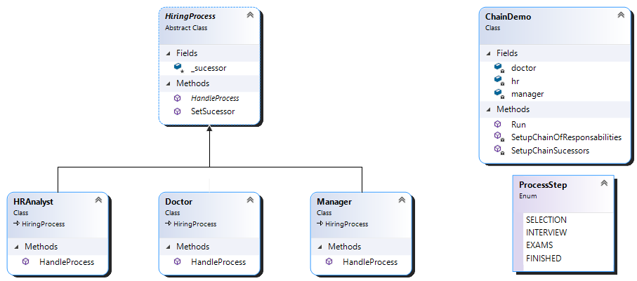
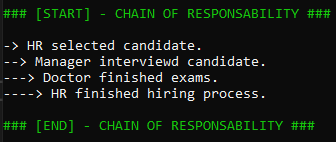

1. Goal 
   Avoid coupling the sender of a request to its receiver by giving more than one object a chance to handle the request. 
   Chain the receiving objects and pass the request along the chain until an object handles it.
2. Participants 
   - Handler 
     - Represented by "HiringProcess" abstract class.
   - Concrete Handler
     - Represented by "HRAnalyst", "Manager" and "Doctor" are those who can handle the request it is responsible for.
     - Can access its successor.
     - If the ConcreteHandler can handle the request, it does so; otherwise it forwards the request to its successor.
   - Client
     - Represented by "ChainDemo".
     - Initiates the request to a ConcreteHandler object on the chain
3. Class Diagram
   
4. In execution...
   
