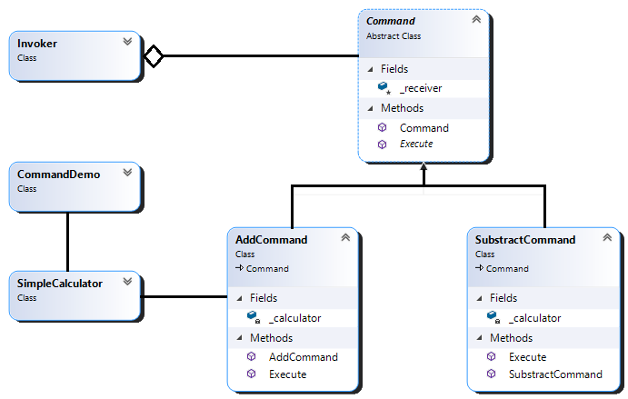
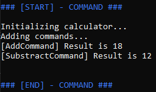

1. Goal 
   Encapsulates a request as an object that contains all the information about the request, including requests for queues or logs, allowing for much more complex architectures.
2. Participants 
   - Command 
     - Declares an interface for the execution of an operation.
     - Represented by "Command" abstract class.
   - Concrete Command
     - Defines a binding between a Receiver and an action
     - Represented by "AddCommand" and "SubstractCommand".
   - Client
     - Represented by "CommandDemo".
     - Creates a ConcreteCommand object and sets a Receiver for the command.
   - Invoker
     - Demands the command carry out its request.
   - Receiver
     - Represented by "SimpleCalculator".
     - Knows hot to execute the operations associated with the action of the request.
3. Class Diagram
   
4. In execution... 
   
